[](https://zenodo.org/badge/latestdoi/492838715)

This repository contains verifiable models and associated material for our System-on-Chip (SoC) Life Cycle Management System (LCMS) case study.
Two distinct aspects of this LCMS are modeled:
* Its cryptographic protocol, using [VerifPal](https://verifpal.com/).
* Its architecture model, using [AnimUML](https://github.com/fjouault/AnimUML).

# Cryptographic Protocol Model

The cryptographic protocol was first modeled as semi-formal UML sequence diagrams before being formalized using VerifPal.

## Semi-formal Protocol Model

### Main Sequence Diagram

This sequence diagram contains references to sub-diagrams that are given below.

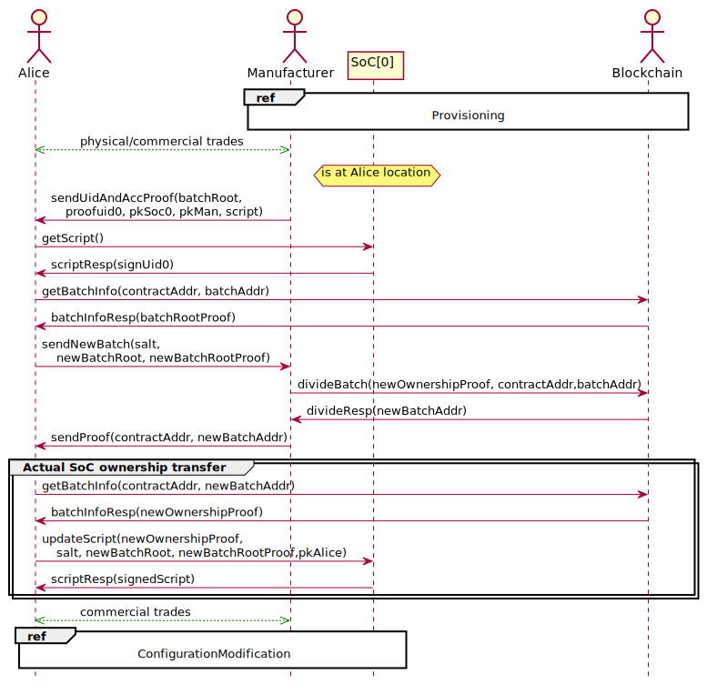

### Provisioning

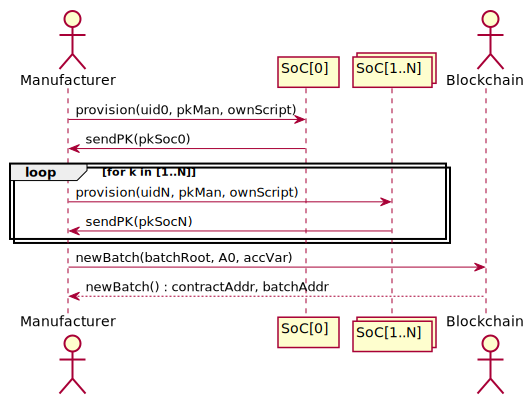

### ConfigurationModification

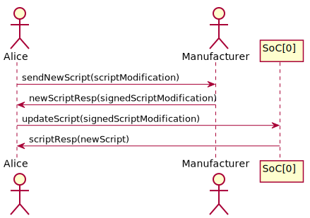

## Verifiable Protocol Model

The full VerifPal model is available in [LCMS_Protocol_Model.vp](LCMS_Protocol_Model.vp).

VerifPal is a software tool for verifying the security of cryptographic protocols.
It is available for Windows and Linux from [this page](https://verifpal.com/software/).

In order to verify the VerifPal model, run the following command:

```
./verifpal verify path/to/LCMS_Protocol_Model.vp
```
With "path/to" the path to the `LCMS_Protocol_Model.vp` file.

Protocol verification takes several hours.

VerifPal can also generate the following visual representation thanks to its [visual studio extension](https://marketplace.visualstudio.com/items?itemName=symbolicsoft.verifpal):

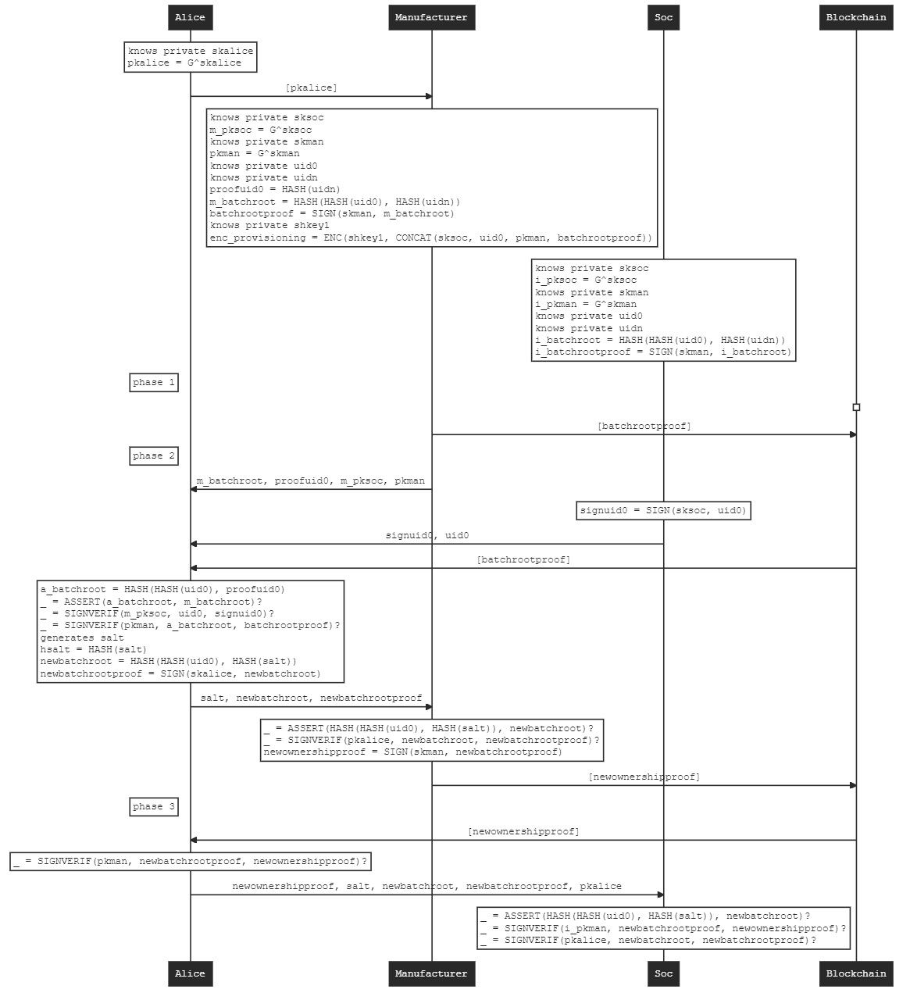


# AnimUML Architecture Model

You can [open the full model in AnimUML](https://animuml20220518.kher.nl/AnimUML.html#{%22name%22:%22Imported_ICLCM%22,%22objects%22:[{%22name%22:%22Blockchain%22,%22isActor%22:true,%22stateByName%22:{%22init%22:{%22type%22:%22Pseudostate%22,%22kind%22:%22initial%22},%22smartContract%22:{%22internalTransitions%22:{%22T1%22:{%22trigger%22:%22getBatchInfo()%22,%22effect%22:%22User.batchInfoResp();%22},%22T2%22:{%22trigger%22:%22divideBatch()%22,%22effect%22:%22User.divideResp();%22}}}},%22transitionByName%22:{%22init2smartContract_1%22:{%22source%22:%22init%22,%22target%22:%22smartContract%22}},%22operationByName%22:{%22getBatchInfo%22:{%22private%22:false},%22divideBatch%22:{%22private%22:false}}},{%22name%22:%22User%22,%22isActor%22:true,%22stateByName%22:{%22init%22:{%22type%22:%22Pseudostate%22,%22kind%22:%22initial%22},%22Actions%22:{%22internalTransitions%22:{%22T1%22:{%22guard%22:%22EP_IS_EMPTY(User)%20&&%20EP_IS_EMPTY(SecureStorage)%20&&%20EP_IS_EMPTY(SoCIPs)%22,%22effect%22:%22iface.setLcmOn();%22},%22T2%22:{%22guard%22:%22EP_IS_EMPTY(User)%20&&%20EP_IS_EMPTY(SecureStorage)%20&&%20EP_IS_EMPTY(SoCIPs)%22,%22effect%22:%22iface.setLcmOff();%22},%22T3%22:{%22guard%22:%22EP_IS_EMPTY(User)%20&&%20EP_IS_EMPTY(SecureStorage)%20&&%20EP_IS_EMPTY(SoCIPs)%22,%22effect%22:%22iface.powerOn();%22},%22T4%22:{%22guard%22:%22EP_IS_EMPTY(User)%20&&%20EP_IS_EMPTY(SecureStorage)%20&&%20EP_IS_EMPTY(SoCIPs)%22,%22effect%22:%22iface.powerOff();%22},%22T5%22:{%22guard%22:%22EP_IS_EMPTY(User)%20&&%20EP_IS_EMPTY(SecureStorage)%20&&%20EP_IS_EMPTY(SoCIPs)%22,%22effect%22:%22iface.updateScript(true);%22},%22T6%22:{%22guard%22:%22EP_IS_EMPTY(User)%20&&%20EP_IS_EMPTY(SecureStorage)%20&&%20EP_IS_EMPTY(SoCIPs)%22,%22effect%22:%22iface.updateScript(false);%22},%22T7%22:{%22guard%22:%22EP_IS_EMPTY(User)%20&&%20EP_IS_EMPTY(SecureStorage)%20&&%20EP_IS_EMPTY(SoCIPs)%22,%22effect%22:%22iface.getScript();%22},%22T8%22:{%22trigger%22:%22scriptResp()%22},%22T9%22:{%22guard%22:%22EP_IS_EMPTY(Blockchain)%20&&%20EP_IS_EMPTY(User)%20&&%20EP_IS_EMPTY(SecureStorage)%20&&%20EP_IS_EMPTY(SoCIPs)%22,%22effect%22:%22Blockchain.getBatchInfo();%22},%22T10%22:{%22guard%22:%22EP_IS_EMPTY(Blockchain)%20&&%20EP_IS_EMPTY(User)%20&&%20EP_IS_EMPTY(SecureStorage)%20&&%20EP_IS_EMPTY(SoCIPs)%22,%22effect%22:%22Blockchain.divideBatch();%22},%22T11%22:{%22trigger%22:%22batchInfoResp()%22},%22T12%22:{%22trigger%22:%22divideResp()%22}}}},%22transitionByName%22:{%22init2Actions_1%22:{%22source%22:%22init%22,%22target%22:%22Actions%22}},%22operationByName%22:{%22scriptResp%22:{%22private%22:false},%22divideResp%22:{%22private%22:false},%22batchInfoResp%22:{%22private%22:false}}},{%22name%22:%22iface%22,%22class%22:%22ChipInterface%22,%22stateByName%22:{%22init%22:{%22type%22:%22Pseudostate%22,%22kind%22:%22initial%22},%22icInterface%22:{%22stateByName%22:{%22choiceUpdate%22:{%22kind%22:%22choice%22},%22init%22:{%22type%22:%22Pseudostate%22,%22kind%22:%22initial%22},%22pOnLcmOn%22:{%22internalTransitions%22:{%22T1%22:{%22trigger%22:%22setLcmOn()%22},%22T2%22:{%22trigger%22:%22setLcmOff()%22},%22T3%22:{%22trigger%22:%22powerOn()%22}}},%22pOnLcmOff%22:{%22internalTransitions%22:{%22T1%22:{%22trigger%22:%22updateScript(_)%22},%22T2%22:{%22trigger%22:%22getScript()%22},%22T3%22:{%22trigger%22:%22setLcmOn()%22},%22T4%22:{%22trigger%22:%22setLcmOff()%22},%22T5%22:{%22trigger%22:%22powerOn()%22}}},%22pOffLcmOff%22:{%22internalTransitions%22:{%22T1%22:{%22trigger%22:%22updateScript(_)%22},%22T2%22:{%22trigger%22:%22getScript()%22},%22T3%22:{%22trigger%22:%22powerOff()%22},%22T4%22:{%22trigger%22:%22setLcmOff()%22}}},%22pOffLcmOn%22:{%22internalTransitions%22:{%22T1%22:{%22trigger%22:%22updateScript(_)%22},%22T2%22:{%22trigger%22:%22getScript()%22},%22T3%22:{%22trigger%22:%22powerOff()%22},%22T4%22:{%22trigger%22:%22setLcmOn()%22}}}},%22transitionByName%22:{%22init2pOffLcmOff_1%22:{%22source%22:%22init%22,%22target%22:%22pOffLcmOff%22},%22pOffLcmOff2pOnLcmOff_1%22:{%22source%22:%22pOffLcmOff%22,%22target%22:%22pOnLcmOff%22,%22trigger%22:%22powerOn()%22,%22effect%22:%22manager.powerOn(false);%22},%22pOnLcmOff2pOffLcmOff_1%22:{%22source%22:%22pOnLcmOff%22,%22target%22:%22pOffLcmOff%22,%22trigger%22:%22powerOff()%22,%22effect%22:%22manager.powerOff();%22},%22pOffLcmOff2pOffLcmOn_1%22:{%22source%22:%22pOffLcmOff%22,%22target%22:%22pOffLcmOn%22,%22trigger%22:%22setLcmOn()%22},%22pOffLcmOn2pOffLcmOff_1%22:{%22source%22:%22pOffLcmOn%22,%22target%22:%22pOffLcmOff%22,%22trigger%22:%22setLcmOff()%22},%22pOffLcmOn2pOnLcmOn_1%22:{%22source%22:%22pOffLcmOn%22,%22target%22:%22pOnLcmOn%22,%22trigger%22:%22powerOn()%22,%22effect%22:%22manager.powerOn(true);%22},%22pOnLcmOn2pOffLcmOn_1%22:{%22source%22:%22pOnLcmOn%22,%22target%22:%22pOffLcmOn%22,%22trigger%22:%22powerOff()%22,%22effect%22:%22manager.powerOff();%22},%22pOnLcmOn2waitingScriptResp_1%22:{%22source%22:%22pOnLcmOn%22,%22target%22:%22waitingScriptResp%22,%22trigger%22:%22getScript()%22,%22effect%22:%22manager.getScript();%22},%22waitingScriptResp2pOnLcmOn_1%22:{%22source%22:%22waitingScriptResp%22,%22target%22:%22pOnLcmOn%22,%22trigger%22:%22scriptResp()%22,%22effect%22:%22User.scriptResp();%22},%22pOnLcmOn2choiceUpdate_1%22:{%22source%22:%22pOnLcmOn%22,%22target%22:%22choiceUpdate%22,%22trigger%22:%22updateScript(success)%22},%22choiceUpdate2waitingScriptUpdate_1%22:{%22source%22:%22choiceUpdate%22,%22target%22:%22waitingScriptUpdate%22,%22guard%22:%22success%20==%20true%22,%22effect%22:%22manager.updateScript(true);%22},%22choiceUpdate2waitingScriptUpdate_2%22:{%22source%22:%22choiceUpdate%22,%22target%22:%22waitingScriptUpdate%22,%22guard%22:%22else%22,%22effect%22:%22manager.updateScript(false);%22},%22waitingScriptUpdate2pOnLcmOn_1%22:{%22source%22:%22waitingScriptUpdate%22,%22target%22:%22pOnLcmOn%22,%22trigger%22:%22scriptResp()%22,%22effect%22:%22User.scriptResp();%22}}}},%22transitionByName%22:{%22init2icInterface_1%22:{%22source%22:%22init%22,%22target%22:%22icInterface%22}},%22operationByName%22:{%22powerOn%22:{%22private%22:false},%22powerOff%22:{%22private%22:false},%22setLcmOn%22:{%22private%22:false},%22setLcmOff%22:{%22private%22:false},%22getScript%22:{%22private%22:false},%22scriptResp%22:{%22private%22:false},%22updateScript%22:{%22parameters%22:[{%22name%22:%22isValid%22,%22type%22:%22Boolean%22}],%22private%22:false}}},{%22name%22:%22manager%22,%22class%22:%22ChipLifeCycleManager%22,%22stateByName%22:{%22bootChoice%22:{%22kind%22:%22choice%22},%22init%22:{%22type%22:%22Pseudostate%22,%22kind%22:%22initial%22},%22normalMode%22:{%22stateByName%22:{%22init%22:{%22type%22:%22Pseudostate%22,%22kind%22:%22initial%22}},%22transitionByName%22:{%22init2nmWaiting_1%22:{%22source%22:%22init%22,%22target%22:%22nmWaiting%22,%22effect%22:%22ipCtrlr.powerOn();%22},%22nmWaiting2nmWorking_1%22:{%22source%22:%22nmWaiting%22,%22target%22:%22nmWorking%22,%22trigger%22:%22ipConfigured()%22},%22nmWorking2waitingScript_1%22:{%22source%22:%22nmWorking%22,%22target%22:%22waitingScript%22,%22trigger%22:%22wakeUp()%22,%22effect%22:%22SecureStorage.getScript();%22},%22waitingScript2updatingConfig_1%22:{%22source%22:%22waitingScript%22,%22target%22:%22updatingConfig%22,%22trigger%22:%22scriptResp()%22,%22effect%22:%22SecureStorage.setConfig();%22},%22updatingConfig2waitingConfigration_1%22:{%22source%22:%22updatingConfig%22,%22target%22:%22waitingConfigration%22,%22trigger%22:%22writeAck()%22,%22effect%22:%22ipCtrlr.updateConfig();%22},%22waitingConfigration2nmWorking_1%22:{%22source%22:%22waitingConfigration%22,%22target%22:%22nmWorking%22,%22trigger%22:%22ipConfigured()%22,%22effect%22:%22sClk.stopAlarm();%5CnIT%20=%20false;%22}}},%22clcmMode%22:{%22stateByName%22:{%22choice1%22:{%22kind%22:%22choice%22},%22init%22:{%22type%22:%22Pseudostate%22,%22kind%22:%22initial%22},%22executingScript%22:{%22internalTransitions%22:{%22T1%22:{%22guard%22:%22IT%20!=%20true%22,%22effect%22:%22sClk.setAlarm();%5CnIT%20=%20true;%22}}}},%22transitionByName%22:{%22init2clcmWaiting_1%22:{%22source%22:%22init%22,%22target%22:%22clcmWaiting%22,%22effect%22:%22valid%20=%20false;%22},%22clcmWaiting2clcmWaitingScript2_1%22:{%22source%22:%22clcmWaiting%22,%22target%22:%22clcmWaitingScript2%22,%22trigger%22:%22getScript()%22,%22effect%22:%22SecureStorage.getScript();%22},%22clcmWaitingScript22clcmWaiting_1%22:{%22source%22:%22clcmWaitingScript2%22,%22target%22:%22clcmWaiting%22,%22trigger%22:%22scriptResp()%22,%22effect%22:%22iface.scriptResp();%22},%22clcmWaiting2clcmWaitingScript_1%22:{%22source%22:%22clcmWaiting%22,%22target%22:%22clcmWaitingScript%22,%22trigger%22:%22updateScript(_valid)%22,%22effect%22:%22SecureStorage.getScript();%5Cnvalid=_valid;%22},%22clcmWaitingScript2choice1_1%22:{%22source%22:%22clcmWaitingScript%22,%22target%22:%22choice1%22,%22trigger%22:%22scriptResp()%22},%22choice12clcmWaiting_1%22:{%22source%22:%22choice1%22,%22target%22:%22clcmWaiting%22,%22guard%22:%22else%22,%22effect%22:%22scriptResp();%22},%22choice12executingScript_1%22:{%22source%22:%22choice1%22,%22target%22:%22executingScript%22,%22guard%22:%22valid%20==%20true%22,%22effect%22:%22SecureStorage.setScript(true);%5Cnvalid=false;%22},%22executingScript2waitingConfigWrite_1%22:{%22source%22:%22executingScript%22,%22target%22:%22waitingConfigWrite%22,%22trigger%22:%22writeAck()%22,%22effect%22:%22iface.scriptResp();%5CnSecureStorage.setConfig();%22},%22waitingConfigWrite2clcmWaiting_1%22:{%22source%22:%22waitingConfigWrite%22,%22target%22:%22clcmWaiting%22,%22trigger%22:%22writeAck()%22}}}},%22transitionByName%22:{%22init2lcmsWaitingPowerOn_1%22:{%22source%22:%22init%22,%22target%22:%22lcmsWaitingPowerOn%22},%22lcmsWaitingPowerOn2bootChoice_1%22:{%22source%22:%22lcmsWaitingPowerOn%22,%22target%22:%22bootChoice%22,%22trigger%22:%22powerOn(lcmPin)%22},%22bootChoice2clcmMode_1%22:{%22source%22:%22bootChoice%22,%22target%22:%22clcmMode%22,%22guard%22:%22lcmPin%20==%20true%22},%22bootChoice2normalMode_1%22:{%22source%22:%22bootChoice%22,%22target%22:%22normalMode%22,%22guard%22:%22else%22},%22normalMode2lcmsWaitingPowerOn_1%22:{%22source%22:%22normalMode%22,%22target%22:%22lcmsWaitingPowerOn%22,%22trigger%22:%22powerOff()%22,%22effect%22:%22ipCtrlr.powerOff();%22},%22clcmMode2lcmsWaitingPowerOn_1%22:{%22source%22:%22clcmMode%22,%22target%22:%22lcmsWaitingPowerOn%22,%22trigger%22:%22powerOff()%22}},%22operationByName%22:{%22powerOn%22:{%22parameters%22:[{%22name%22:%22lcmPin%22,%22type%22:%22Boolean%22}],%22private%22:false},%22powerOff%22:{%22private%22:false},%22updateScript%22:{%22parameters%22:[{%22name%22:%22isValid%22,%22type%22:%22Boolean%22}],%22private%22:false},%22wakeUp%22:{%22private%22:false},%22ipConfigured%22:{%22private%22:false},%22getScript%22:{%22private%22:false},%22scriptResp%22:{%22private%22:false},%22writeAck%22:{%22private%22:false}}},{%22name%22:%22ipCtrlr%22,%22class%22:%22IPActivationController%22,%22stateByName%22:{%22init%22:{%22type%22:%22Pseudostate%22,%22kind%22:%22initial%22},%22powerOn%22:{%22stateByName%22:{%22init%22:{%22type%22:%22Pseudostate%22,%22kind%22:%22initial%22}},%22transitionByName%22:{%22init2settingConfig_1%22:{%22source%22:%22init%22,%22target%22:%22settingConfig%22,%22effect%22:%22SecureStorage.getConfig();%22},%22settingConfig2waitingUpdate_1%22:{%22source%22:%22settingConfig%22,%22target%22:%22waitingUpdate%22,%22trigger%22:%22configResp()%22,%22effect%22:%22SoCIPs.setIPs();%5Cnmanager.ipConfigured();%22},%22waitingUpdate2settingConfig_1%22:{%22source%22:%22waitingUpdate%22,%22target%22:%22settingConfig%22,%22trigger%22:%22updateConfig()%22,%22effect%22:%22SecureStorage.getConfig();%22}}}},%22transitionByName%22:{%22init2powerOff_1%22:{%22source%22:%22init%22,%22target%22:%22powerOff%22},%22powerOff2powerOn_1%22:{%22source%22:%22powerOff%22,%22target%22:%22powerOn%22,%22trigger%22:%22powerOn()%22},%22powerOn2powerOff_1%22:{%22source%22:%22powerOn%22,%22target%22:%22powerOff%22,%22trigger%22:%22powerOff()%22}},%22operationByName%22:{%22powerOn%22:{%22private%22:false},%22powerOff%22:{%22private%22:false},%22updateConfig%22:{%22private%22:false},%22configResp%22:{%22private%22:false},%22IPsAreSet%22:{%22private%22:false}}},{%22name%22:%22SecureStorage%22,%22isActor%22:true,%22stateByName%22:{%22init%22:{%22type%22:%22Pseudostate%22,%22kind%22:%22initial%22},%22memAccess%22:{%22internalTransitions%22:{%22T1%22:{%22trigger%22:%22getScript()%22,%22effect%22:%22manager.scriptResp();%22},%22T2%22:{%22trigger%22:%22getConfig()%22,%22effect%22:%22ipCtrlr.configResp();%22},%22T3%22:{%22trigger%22:%22setScript(none)%22,%22effect%22:%22manager.writeAck();%22},%22T4%22:{%22trigger%22:%22setConfig()%22,%22effect%22:%22manager.writeAck();%22}}}},%22transitionByName%22:{%22init2memAccess_1%22:{%22source%22:%22init%22,%22target%22:%22memAccess%22}},%22operationByName%22:{%22getScript%22:{%22private%22:false},%22scriptResp%22:{%22private%22:false},%22setScript%22:{%22parameters%22:[{%22name%22:%22isValid%22,%22type%22:%22Boolean%22}],%22private%22:false},%22getConfig%22:{%22private%22:false},%22setConfig%22:{%22private%22:false}}},{%22name%22:%22sClk%22,%22class%22:%22SecureTimingSystem%22,%22stateByName%22:{%22init%22:{%22type%22:%22Pseudostate%22,%22kind%22:%22initial%22}},%22transitionByName%22:{%22init2stsWaiting_1%22:{%22source%22:%22init%22,%22target%22:%22stsWaiting%22},%22stsWaiting2stsCounting_1%22:{%22source%22:%22stsWaiting%22,%22target%22:%22stsCounting%22,%22trigger%22:%22setAlarm()%22},%22stsCounting2stsWakeUp_1%22:{%22source%22:%22stsCounting%22,%22target%22:%22stsWakeUp%22,%22trigger%22:%22after(10day)%22,%22effect%22:%22manager.wakeUp();%22},%22stsWakeUp2stsWaiting_1%22:{%22source%22:%22stsWakeUp%22,%22target%22:%22stsWaiting%22,%22trigger%22:%22stopAlarm()%22}},%22operationByName%22:{%22setAlarm%22:{%22private%22:false},%22stopAlarm%22:{%22private%22:false}}},{%22name%22:%22SoCIPs%22,%22isActor%22:true,%22stateByName%22:{%22init%22:{%22type%22:%22Pseudostate%22,%22kind%22:%22initial%22},%22waitingConfig%22:{%22internalTransitions%22:{%22T1%22:{%22trigger%22:%22setIPs()%22}}}},%22transitionByName%22:{%22init2waitingConfig_1%22:{%22source%22:%22init%22,%22target%22:%22waitingConfig%22}},%22operationByName%22:{%22setIPs%22:{%22private%22:false}}}],%22connectorByName%22:{%22users2ledger%22:{%22ends%22:[%22User%22,%22Blockchain%22],%22endNames%22:[%22user%22,%22ledger%22],%22possibleMessages%22:{%22forward%22:[%22getBatchInfo%22,%22divideBatch%22],%22reverse%22:[%22batchInfoResp%22,%22divideResp%22]}},%22users2ci%22:{%22ends%22:[%22User%22,%22iface%22],%22endNames%22:[%22user%22,%22ci%22],%22possibleMessages%22:{%22forward%22:[%22updateScript%22,%22getScript%22,%22powerOn%22,%22powerOff%22,%22setLcmOn%22,%22setLcmOff%22],%22reverse%22:[%22scriptResp%22]}},%22ci2clcm%22:{%22ends%22:[%22iface%22,%22manager%22],%22endNames%22:[%22ci%22,%22clcm%22],%22possibleMessages%22:{%22forward%22:[%22updateScript%22,%22getScript%22,%22powerOn%22,%22powerOff%22],%22reverse%22:[%22scriptResp%22]}},%22clcm2sstr%22:{%22ends%22:[%22manager%22,%22SecureStorage%22],%22endNames%22:[%22sstr%22,%22clcm%22],%22possibleMessages%22:{%22forward%22:[%22getScript%22,%22setScript%22,%22setConfig%22],%22reverse%22:[%22scriptResp%22,%22writeAck%22]}},%22sts2clcm%22:{%22ends%22:[%22sClk%22,%22manager%22],%22endNames%22:[%22sts%22,%22clcm%22],%22possibleMessages%22:{%22forward%22:[%22wakeUp%22],%22reverse%22:[%22setAlarm%22,%22stopAlarm%22]}},%22ipac2sstr%22:{%22ends%22:[%22ipCtrlr%22,%22SecureStorage%22],%22endNames%22:[%22ipac%22,%22sstr%22],%22possibleMessages%22:{%22forward%22:[%22getConfig%22],%22reverse%22:[%22configResp%22]}},%22clcm2ipac%22:{%22ends%22:[%22manager%22,%22ipCtrlr%22],%22endNames%22:[%22clcm%22,%22ipac%22],%22possibleMessages%22:{%22forward%22:[%22updateConfig%22,%22powerOn%22,%22powerOff%22],%22reverse%22:[%22ipConfigured%22]}},%22ipac2socip%22:{%22ends%22:[%22ipCtrlr%22,%22SoCIPs%22],%22endNames%22:[%22ipac%22,%22socip%22],%22possibleMessages%22:{%22forward%22:[%22setIPs%22]}}},%22watchExpressions%22:{%22ifaceHasPowerOff%22:%22EP_CONTAINS(iface,%20powerOff)%22,%22clcmOff%22:%22IS_IN_STATE(manager,manager.lcmsWaitingPowerOn)%22,%22ipacOff%22:%22IS_IN_STATE(ipCtrlr,ipCtrlr.powerOff)%22,%22chipIsShutdown%22:%22IS_IN_STATE(manager,manager.lcmsWaitingPowerOn)%20&&%20IS_IN_STATE(ipCtrlr,ipCtrlr.powerOff)%22,%22ifaceHasScriptMessage%22:%22EP_CONTAINS(iface,%20updateScript)%20||%20EP_CONTAINS(iface,%20getScript)%22,%22userHasScriptResp%22:%22EP_CONTAINS(User,%20scriptResp)%22,%22ifaceIsInStatePOnLcmOn%22:%22IS_IN_STATE(iface,%20iface.icInterface.pOnLcmOn)%22,%22sstrHasSetScript%22:%22EP_CONTAINS(SecureStorage,%20setScript)%22,%22sstrHasSetConfig%22:%22EP_CONTAINS(SecureStorage,%20setConfig)%22,%22memoryWrite%22:%22EP_CONTAINS(SecureStorage,%20setScript)%20||%20EP_CONTAINS(SecureStorage,%20setConfig)%22,%22managerHasValidUpdate%22:%22IS_IN_STATE(manager,manager.clcmMode.executingScript)%22,%22IPsHasSetIP%22:%22EP_CONTAINS(SoCIPs,%20setIPs)%22},%22LTLProperties%22:{%22sanityCheck1%22:%22[](ifaceHasPowerOff%20-%3E%20%3C%3EchipIsShutdown)%22,%22liveness1_P4%22:%22[]([]ifaceIsInStatePOnLcmOn%20-%3E%20[](ifaceHasScriptMessage%20-%3E%20%3C%3E(userHasScriptResp%20||%20ifaceHasPowerOff)))%22,%22notDeadlock%22:%22[]%20!|deadlock|%22,%22safety1_P5%22:%22[](managerHasValidUpdate%20-%3E%20%3C%3E(memoryWrite%20||%20ifaceHasPowerOff))%22,%22safety2_P6%22:%22[](%3C%3EIPsHasSetIP%20-%3E%20(sstrHasSetScript%20-%3E%20(!IPsHasSetIP%20U%20(sstrHasSetConfig%20&&%20!IPsHasSetIP)))%20U%20IPsHasSetIP)%22},%22settings%22:{%22display%22:{%22hideLinks%22:false,%22hideClasses%22:false,%22hideOperations%22:false,%22hideMethods%22:false,%22showPorts%22:false,%22showEndNames%22:false,%22hideStateMachines%22:false,%22hideOuterSMBoxes%22:false,%22showExplicitSM%22:false,%22hideStates%22:false,%22showPseudostateInvariants%22:false,%22hideSets%22:false,%22showTransitions%22:false},%22semantics%22:{%22fireInitialTransitions%22:true,%22autoFireAfterChoice%22:true,%22autoReceiveDisabled%22:false,%22considerGuardsTrue%22:false,%22checkEvents%22:true,%22keepOneMessagePerTrigger%22:true,%22enableEventPools%22:true,%22matchFirst%22:true,%22symbolicValues%22:false,%22reactiveSystem%22:true},%22interface%22:{%22hideEmptyHistory%22:false,%22disableInteractionSelection%22:false,%22disableModelSelection%22:false,%22disableObjectSelection%22:false,%22disableDoc%22:false,%22disableSettings%22:false,%22disableHistorySettings%22:false,%22disableReset%22:false,%22disableSwitchDiagram%22:false,%22onlyInteraction%22:false,%22hideInteraction%22:false,%22disableExports%22:false,%22hideHistory%22:false,%22disableEdit%22:false,%22historyType%22:%22TCSVG%20sequence%22},%22tools%22:{}}})
in order to browse the model, animate it, or even verify it.
You may check AnimUML's [documentation](https://animuml20220518.kher.nl/doc.html) and [tutorial](https://animuml20220518.kher.nl/tutorial.html) for more information on using it.

The model analysis menu (left-hand side) makes it possible to see watch expressions (with their current values), and LTL properties.
Additionally, it can be used to perform in-browser analysis, such as state space exploration.
LTL model checking requires connecting to the [OBP2](http://www.obpcdl.org/) model checker.
This can be achieved by opening "Connect to external analysis tool", and clicking the `Ok` button.
The `VERIFY_LTL_PROPERTY` action that then appears can be used to verify a single property (selected with a drop-down list) at a time.

Note that LTL model checking can take several minutes without visible feedback (this is a known issue).
Moreover, because the model checker is in the cloud while the model is executed in your browser, internet connection latency can be an issue.
Using a local installation of OBP2 significantly decreases verification time, but this is not publicly available at this time.

Alternatively, you may simply have a look at the diagrams generated by AnimUML, which are inlined below.

## Model Entities and Messages
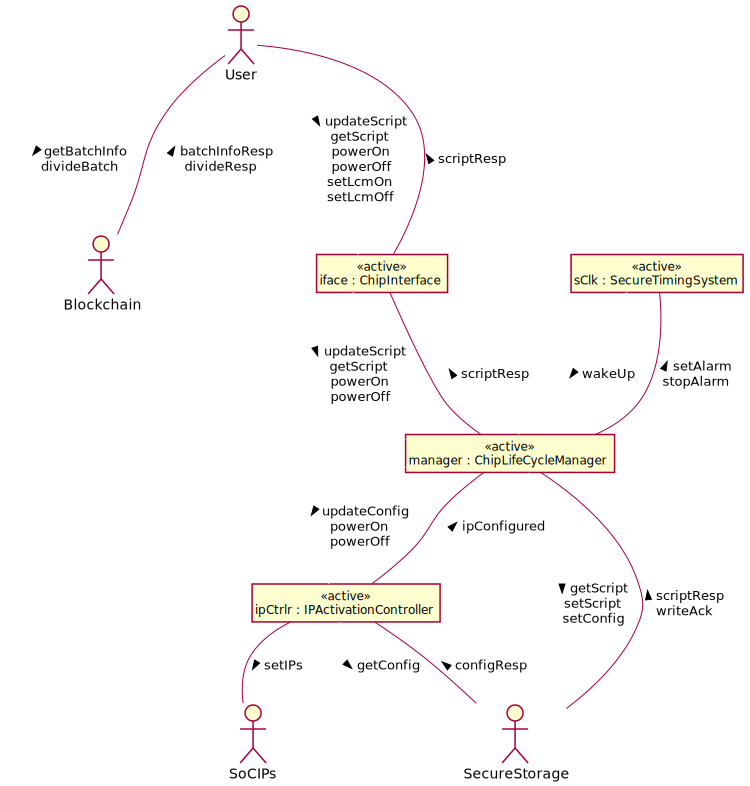

## System Object Behaviors

### `manager` State Machine

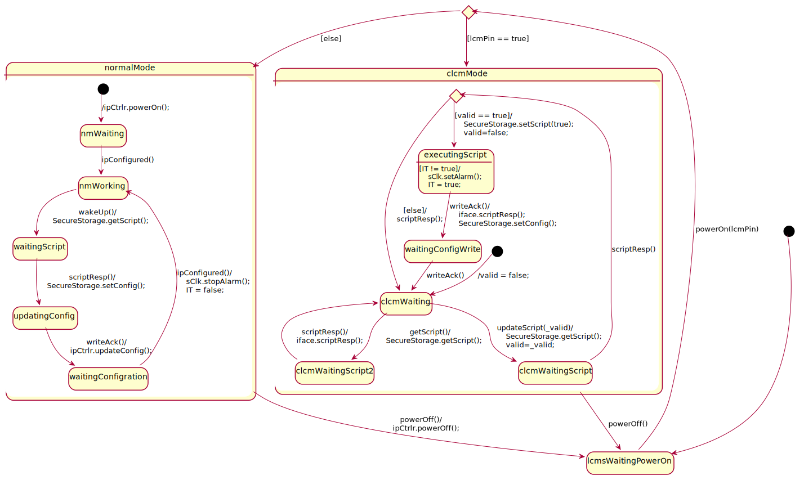

### `iface` State Machine

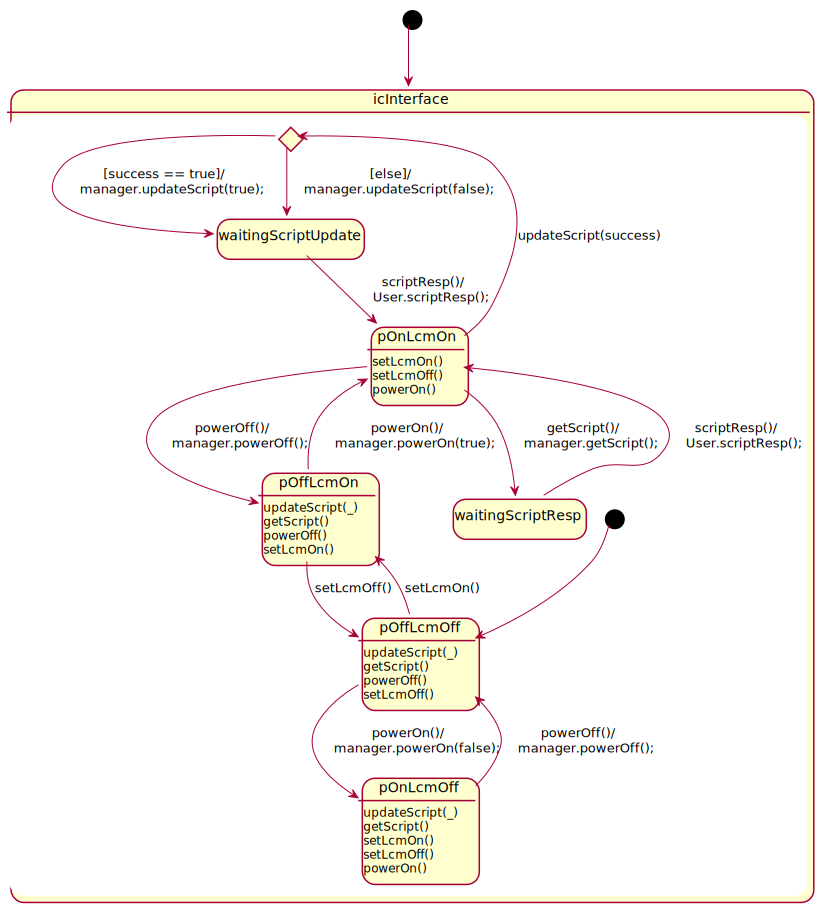

### `ipCtrlr` State Machine

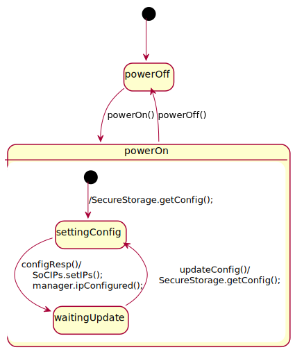

### `sClk` State Machine

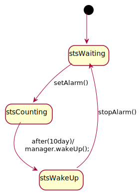

## Environment Behaviors

### `User` State Machine

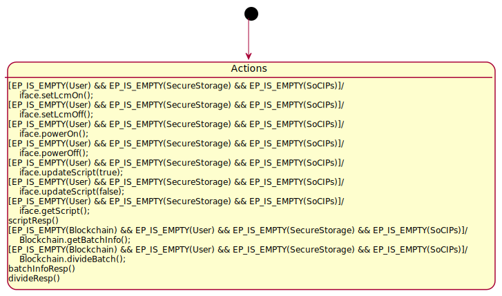

### `Blockchain` State Machine

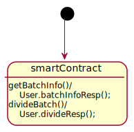

### `SecureStorage` State Machine

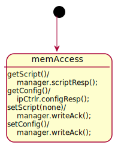

### `SoCIPs` State Machine

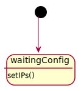

